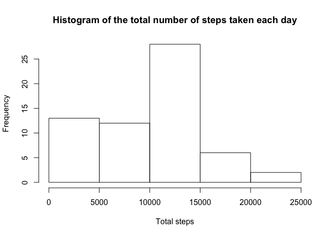
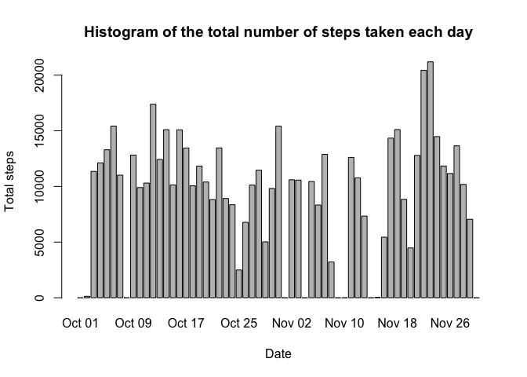
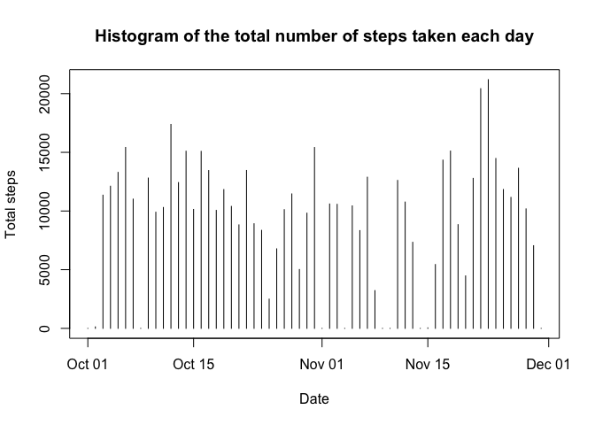
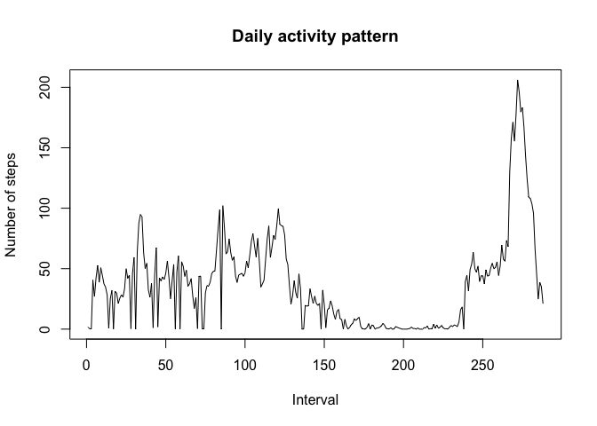
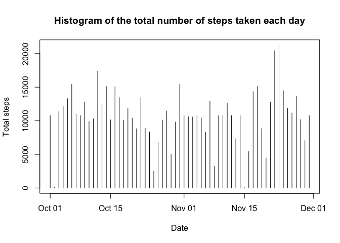
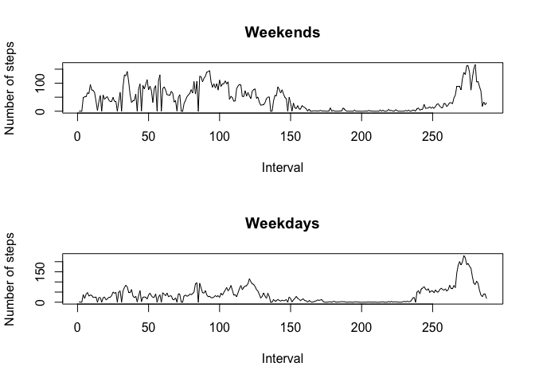
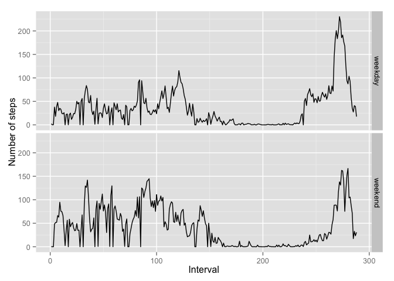

# Reproducible Research: Peer Assessment 1

## Some preparations

```r
library(dplyr)
Sys.setlocale("LC_TIME", "C")
```

## Loading and preprocessing the data
### Load data

```r
steps <- tbl_df(
    read.csv(
        unz("activity.zip", "activity.csv"),
        colClasses = c("integer", "factor", "factor")
    )
) 
```

### Data structure

```r
str(steps)
```

```
## Classes 'tbl_df', 'tbl' and 'data.frame':	17568 obs. of  3 variables:
##  $ steps   : int  NA NA NA NA NA NA NA NA NA NA ...
##  $ date    : Factor w/ 61 levels "2012-10-01","2012-10-02",..: 1 1 1 1 1 1 1 1 1 1 ...
##  $ interval: Factor w/ 288 levels "0","10","100",..: 1 226 2 73 136 195 198 209 212 223 ...
```


## What is mean total number of steps taken per day?
### The total number of steps taken per day

```r
steps_per_date <- 
    steps %>%
        select(date, steps) %>%
        group_by(date) %>%
        summarize(total_steps = sum(steps, na.rm = TRUE)) %>%
        mutate(date = as.Date(date))

head(steps_per_date)
```

```
## Source: local data frame [6 x 2]
## 
##         date total_steps
##       (date)       (int)
## 1 2012-10-01           0
## 2 2012-10-02         126
## 3 2012-10-03       11352
## 4 2012-10-04       12116
## 5 2012-10-05       13294
## 6 2012-10-06       15420
```

### Histogram of the total number of steps taken each day
#### Histogram

```r
with(
    steps_per_date,
    hist(
        total_steps,
        xlab = "Total steps",
        main = "Histogram of the total number of steps taken each day"
    )
)
```

 

#### Barplot

```r
with(
    steps_per_date,
    barplot(
        total_steps, names.arg = format(date, "%b %d"),
        xlab = "Date", ylab = "Total steps",
        main = "Histogram of the total number of steps taken each day"
    )
)
```

 

#### Result histogram

```r
with(
    steps_per_date,
    plot(
        date, total_steps, type = "h",
        xlab = "Date", ylab = "Total steps",
        main = "Histogram of the total number of steps taken each day"
    )
)
```

 


### Mean of the total number of steps taken per day

```r
mean_orig <- 
    with(
        steps_per_date,
        mean(total_steps, na.rm = TRUE)
    )

print(mean_orig)
```

```
## [1] 9354.23
```

### Median of the total number of steps taken per day

```r
median_orig <- 
    with(
        steps_per_date,
        median(total_steps, na.rm = TRUE)
    )

print(median_orig)
```

```
## [1] 10395
```

## What is the average daily activity pattern?
### The average number of steps taken, averaged across all days

```r
steps_by_interval <- 
    steps %>%
        select(interval, steps) %>%
        group_by(interval) %>%
        summarize(avg_steps = mean(steps, na.rm = TRUE))

head(steps_by_interval)
```

```
## Source: local data frame [6 x 2]
## 
##   interval  avg_steps
##     (fctr)      (dbl)
## 1        0  1.7169811
## 2       10  0.1320755
## 3      100  0.3207547
## 4     1000 40.5660377
## 5     1005 26.9811321
## 6     1010 42.4150943
```
   
### Plot

```r
with(
    steps_by_interval,
    plot(
        as.integer(interval), avg_steps, type = 'l', col = interval,
        main = "Daily activity pattern", 
        xlab = "Interval", ylab = "Number of steps"
    )
)
```

 

### 5-minute interval which contains the maximum number of steps

```r
steps_by_interval %>%
    filter(avg_steps == max(avg_steps)) %>%
    print
```

```
## Source: local data frame [1 x 2]
## 
##   interval avg_steps
##     (fctr)     (dbl)
## 1      835  206.1698
```

## Imputing missing values
### The total number of missing values in the dataset

```r
steps %>%
    filter(is.na(steps)) %>%
    count
```

```
## Source: local data frame [1 x 1]
## 
##       n
##   (int)
## 1  2304
```


### Filling in all of the missing values in the dataset

```r
aveges <- steps_by_interval$avg_steps
names(aveges) <- steps_by_interval$interval

new_steps <-
    steps %>%
        mutate(
            steps = ifelse(
                is.na(steps),
                aveges[interval],
                steps
            )
        )

head(new_steps)
```

```
## Source: local data frame [6 x 3]
## 
##       steps       date interval
##       (dbl)     (fctr)   (fctr)
## 1 1.7169811 2012-10-01        0
## 2 0.3396226 2012-10-01        5
## 3 0.1320755 2012-10-01       10
## 4 0.1509434 2012-10-01       15
## 5 0.0754717 2012-10-01       20
## 6 2.0943396 2012-10-01       25
```

### The total number of steps taken each day

```r
new_steps_per_date <- 
    new_steps %>%
        select(date, steps) %>%
        group_by(date) %>%
        summarize(total_steps = sum(steps, na.rm = TRUE)) %>%
        mutate(date = as.Date(date))

head(new_steps_per_date)
```

```
## Source: local data frame [6 x 2]
## 
##         date total_steps
##       (date)       (dbl)
## 1 2012-10-01    10766.19
## 2 2012-10-02      126.00
## 3 2012-10-03    11352.00
## 4 2012-10-04    12116.00
## 5 2012-10-05    13294.00
## 6 2012-10-06    15420.00
```

### Histogram of the total number of steps taken per day

```r
with(
    new_steps_per_date,
    plot(
        date, total_steps, type = "h",
        xlab = "Date", ylab = "Total steps",
        main = "Histogram of the total number of steps taken each day"
    )
)
```

 

### Mean of the total number of steps taken per day

```r
mean_new <-
    with(
        new_steps_per_date,
        mean(total_steps)
    )

print(mean_new)
```

```
## [1] 10766.19
```

### Median of the total number of steps taken per day

```r
median_new <-
    with(
        new_steps_per_date,
        median(total_steps)
    )

print(median_new)
```

```
## [1] 10766.19
```

### Conclusions
1. The mean and median of the total number of steps taken per day on filled data list differs from the mean and median on original data.

```r
abs(median_new - median_orig)
```

```
## [1] 371.1887
```

```r
abs(mean_new - mean_orig)
```

```
## [1] 1411.959
```

2. The mean and median of the total number of steps taken per day on filled data list are equals:

```r
median_new - mean_new
```

```
## [1] 0
```


## Are there differences in activity patterns between weekdays and weekends?
### Mutate data

```r
actitvity_by_daytype <-
    new_steps %>%
        mutate(
            daytype = as.factor(
                ifelse(
                    weekdays(
                        as.Date(date),
                        abbreviate = TRUE
                    ) %in% c("Sat", "Sun"),
                    "weekend",
                    "weekday"
                )
            )
        )

str(actitvity_by_daytype)
```

```
## Classes 'tbl_df', 'tbl' and 'data.frame':	17568 obs. of  4 variables:
##  $ steps   : num  1.717 0.3396 0.1321 0.1509 0.0755 ...
##  $ date    : Factor w/ 61 levels "2012-10-01","2012-10-02",..: 1 1 1 1 1 1 1 1 1 1 ...
##  $ interval: Factor w/ 288 levels "0","10","100",..: 1 226 2 73 136 195 198 209 212 223 ...
##  $ daytype : Factor w/ 2 levels "weekday","weekend": 1 1 1 1 1 1 1 1 1 1 ...
```

```r
actitvity_by_daytype_groupped <-
    actitvity_by_daytype %>%
        group_by(daytype, interval) %>%
        summarize(avg_steps = mean(steps))

head(actitvity_by_daytype_groupped)
```

```
## Source: local data frame [6 x 3]
## Groups: daytype [1]
## 
##   daytype interval  avg_steps
##    (fctr)   (fctr)      (dbl)
## 1 weekday        0  2.2511530
## 2 weekday       10  0.1731656
## 3 weekday      100  0.4205451
## 4 weekday     1000 37.8754717
## 5 weekday     1005 18.2197065
## 6 weekday     1010 39.0775681
```

### Plot

```r
par(mfrow = c(2, 1))

with(
    actitvity_by_daytype_groupped %>% filter(daytype == "weekend"),
    plot(
        as.integer(interval), avg_steps, type = 'l',
        main = "Weekends", 
        xlab = "Interval", ylab = "Number of steps"
    )
)

with(
    actitvity_by_daytype_groupped %>% filter(daytype == "weekday"),
    plot(
        as.integer(interval), avg_steps, type = 'l',
        main = "Weekdays", 
        xlab = "Interval", ylab = "Number of steps"
    )
)
```

 

### Plot 2

```r
library(ggplot2)
ggplot2::ggplot(
    actitvity_by_daytype_groupped,
    ggplot2::aes(x = as.integer(interval), y = avg_steps)
) + 
    ggplot2::facet_grid(daytype ~ .) +
    ggplot2::xlab("Interval") + 
    ggplot2::ylab("Number of steps") + 
    ggplot2::geom_line()
```

 
